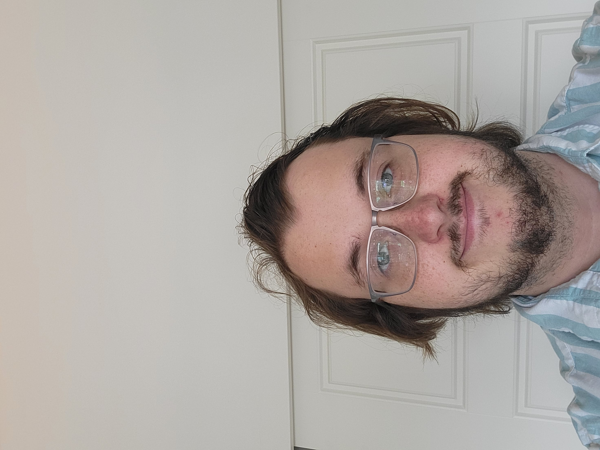

<h1 align="center">Rodney McCoy's Website</h1>

  
  <a href="CV/Resume.pdf">Resume</a> 

  | <a href="CV/CV.pdf">CV</a> | <a href="Calendar.png">Want To Contact Me?</a> | <a href="https://github.com/RodneyMcCoy/RodneyMcCoy/tree/main/Projects And Writing">Other Work</a> 

<h3 align="left">About Me</h3>

 I am a First Year Math Ph.D. student at the University of Utah. My main interests are Algorithms, Applied Analysis, and Number Theory. 

<h3 align="left">Teaching</h3>
<ul>
  <li> I am currently a funded Teaching Assistant at the University of Utah. I will (tentativly) be assisting with Engineering Calculus 1 (Math 1310) this semester. </li>
</ul>

<h3 align="left">Research</h3>
<ul>
  <li> In Spring 2024, I will be funded by the NSF Research Training Grant in "Inversion And Optimization".</li>
  <li> In 2022 - 2023, I was on undergraduate research with Dr. Alex Woo relating to measures of disorder on the symmetric group, an inequality derived from them, and an extension of a condition for when equality holds to the group of signed permutations. You can view the current state of the project <a href="https://github.com/RodneyMcCoy/shallow-permutations">here</a> as I am still sneaking in some work to try to obtain the major result.
  </li>
</ul>

<h3 align="left">Projects</h3>
<ul>
  <li>When I have free time (normally only during breaks), I work on problems from Project Euler.</li>
</ul>
